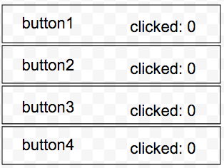

# Motivation, what it is and what is not, background.
 - i'm not an article writer, i'm not the best english speaker.
 - i have a year playing with react and one year with angular (give or take)  
 - This is a talk about the bad parts of the react (i know it may have good parts to)
 - yes angular has bad parts to(this talk is not about them)
 - this talk tries to highlight why react is not always the best solution,


# data flow

## uni directional data flow (flow): 


## mvvm 


**Note:** the fallowing data flow is what a developer should be aware of, its not 100% what happends but is what developers sees from it.


## lets take a simple example



given the above example, we want to make a webpage, when we click the button, a request to the server with its id, the server responds with the update counter and the view needs to render it

### uni directional:
1. button1 clicked
2. component gets the event
3. component creates a action
4. component dispatches the action
5. action gets to the root store something
6. root store something applies middleware
7. middleware1 checks if he needs to do something, he dose not need to do anything
8. middleware2 checks if he needs to do something, he dose not need to do anything
9. ... other middleware
10. request middleware checks if he needs to do something, he stops the action
11. request middleware creates a new action
12. request middleware dispatches the action to root store something
13. root store something applies middleware
14. middleware1 checks if he needs to do something, he dose not need to do anything
15. middleware2 checks if he needs to do something, he dose not need to do anything
16. ... other middleware
17. request middleware checks if he needs to do something, he dose not need to do anything
18. ... other middleware
18. root reducer something sends the action to All the stores
19. store1 checks if he needs to do something, he dose not need to do anything
20. store2 checks if he needs to do something, he dose not need to do anything
21. ... other stores checks 
22. ButtonClickStore checks if he needs to do something, he needs to update
23. ButtonClickStore generates a new state and return it
24. ... other stores checks
24. RootStores sends the new state to the RootReactComponent
25. RootReactComponent sends the new props to all its children components,
26. Button checks if he needs to update, he dose not need to do anything
27. SomeComponent2 checks if he needs to update, he dose not need to do anything
28. ... other components checks
29. Button1 checks if he needs to update, he dose, and he rerenders the template
30. ... other button checks
31. **the request middleware(see step 17) sends the request to the server**
32. server respondes
33. request middleware creates a action 
34. request middleware dispatches the action to the root store something

 ... REPEAT STEPS 6-to-29

 58 Button1 component gets the new props, and updates the counter
 
 59 view gets updated


### mvvm
1. Button clicked
2. component gets the event
3. component calls the service 
4. **Service creates the request to the server**
5. server respondes
6. Service can transform the data if he wants to
7. Component gets the response
8. Component updates its model
9. view gets updated


**Notes**:
in mvvm only the service and the components that are needed knows of the click

# Provider config vs global constants

simple use case:
we have a simple service that has to do a request to the server,
but the api endpoint must be dynamic.

## React

Window.ApiEndpoint = 'https://localhost:3001/';


## Angular
```javascript
	MyApp.config((MyApiProvider) => {
		MyApiProvider.setEndPointUrl('https://localhost:3001/')
	});
```
using angular's constants makes this even better

**Notes**:
i asked Dragos for an article of why global variables are bad, answered:
- Do i really need to give you that?

angular dose not use any globals, and you can even set it async.


# rendering

## JSX > HTML templates?

jsx puts together in the same file the logic of the controller and the html template: 

- big files
- two different concerns in the same file
- no reusable templates
- no swappable templates
- no templating
- more devtools, more webpack loaders, more black boxes that you need to be afraid of 


## directives (don not get them confused with components)
**Scenario**: we have finished mylocal-hq, all works perfectly, now we want/need to gather info about user behaviors to see what we can improve and what user uses more.

**Task**:
create something that can be put on a given part of a page to send all user clicks on that element to the server.

### Angular:

Create a attribute directive, listen to the click element and send the data to the server
It can be applied to any component/non component dom element,
use the steps found at #data flow to send the data to the server
ex:

```html

	<button type='submit' my-analitycs>send</button>
	
```

```html

	<a href='/something/' my-analitycs> some link</a>
	
```


### React
Take the button, create a wrapper over it, that gets the click and then do the steps found at #data flow.
Take the dropdown, create a wrapper over it, that gets the click and then do the steps found at #data flow.
Take the dom a element and wait, you cannot do that, you need create a new component, then gets the click and then do the steps found at #data flow.

Replace all the components that where needed, with the new wrapped component.


**Note**: in react if you want to do anything to a dom thingy you need to abstract it under a component and use the component instead, while angular can simply create a attribute directive and add it

#lets build the analytics directive

## angular

```javascript
import angular from angular;

angular.module('myApp')
  .directive('myAnalytics', function (analyticsService) {
    return {
      restrict: 'A',
      scope: {
        myAnalytics: '=',
      },
      controller: ($scope, $element) => {
        $element.onClick = () => {
          analyticsService.send($scope.myAnalytics)
        }
      }
    }
  });

```

using es6

```javascript
class MyDirective {
    constructor(analyticsService) {
        this.restrict = 'A';        
        this.analyticsService = analyticsService;
    }

    onClick(element) {
        this.analyticsService.send(element.attr('my-analytics'));
    }
}

register('app').directive('myDirective', MyDirective);
```
I don't think this can be closer to my wet dreams....

## react


	import React, {Component, PropTypes} from 'react';
	import cx from 'classnames';
	import shallowCompare from 'react-addons-shallow-compare';
	import Button from 'views/components/buttons';
	import {connect} from 'react-redux';
	import analytics from 'actions/analytics';
	
	
	@connect(
	  () => {},
	  {sendAnalytics: analytics.send}
	)
	export default class Button extends Component {
	
	  static propTypes = {
	    children: React.PropTypes.node,
	    className: React.PropTypes.string,
	    sendAnalytics: React.PropTypes.func,
	    myAnalytics: React.PropTypes.object,
	  };
	  
	  constructor(props){
	    super(props);
	    this.handleClick = this.onClick.bind(this);
	  }
	
	  onClick() {
	    this.props.sendAnalytics(this.props.myAnalytics);
	  }
	
	  shouldComponentUpdate(nextProps, nextState) {
	    return shallowCompare(this, nextProps, nextState);
	  }
	
	  render() {
	    const {
	      className,
	      children,
	      ...props
	      } = this.props;
	
	    const buttonClasses = cx('Button-analytics', className);
	
	    return (
	      <Button {...props} onClick={this.handleClick} className={buttonClasses} >
	        {children}
	      </Button>
	    );
	  }
	}


**NOTE**: angularjs is vanilla js

### Angular2 uses typescript and its blablabla

typescript = es7 + flow type + some oop sugar like interface and private stuff

none: will not end up in production, 

none will slow down your app in production, all are well known standards for any programmer 

you can create a full big application with or without typescript
you can create a full big application with or without es6
you can create a full big application with es5, the code will look pritty much as you may imagine 

http://nicholasjohnson.com/blog/how-to-do-everything-in-angular2-using-es6/


react uses jsx, is a something invented and only used by react, its not an open standard
if you try to write a component without jsx and es6

```javascript
var React = require('react/addons');
var TagsInput = React.createFactory(require('./tagsinput')); // no luck

var TagsComponent = React.createClass({
  displayName: "TagsComponent",
  saveTags: function () {
    console.log('tags: ', this.refs.tags.getTags().join(', '));
  },

  render: function () {
    return (
      React.createElement("div", null,
        React.createElement(TagsInput, {ref: "tags", tags: ["tag1", "tag2"]}),
        React.createElement("button", {onClick: this.saveTags}, "Save")
      )
    );
  }
});

```


**Oh wait the create class is deprecated** how can i create it now?

a simple template that shows two emails with link on them

```javascript
 var ui =
      React.createElement('div', {}, 
        React.createElement('h1', {}, "Contacts"),
        React.createElement('ul', {},
          React.createElement('li', {},
            React.createElement('h2', {}, "James Nelson"),
            React.createElement('a', {href: 'mailto:james@jamesknelson.com'}, 'james@jamesknelson.com')
          ),
          React.createElement('li', {},
            React.createElement('h2', {}, "Joe Citizen"),
            React.createElement('a', {href: 'mailto:joe@example.com'}, 'joe@example.com')
          )
        )
      )
ReactDOM.render(ui, document.getElementById('react-app'))

```

# errors 
## react
### error 1 (doimb)
### error 2 (noitca)


# routers

# perfs 

- angular 1 http://mathieuancelin.github.io/js-repaint-perfs/angular/opt.html
- react http://mathieuancelin.github.io/js-repaint-perfs/react/opt.html
- angular 2 http://mathieuancelin.github.io/js-repaint-perfs/angular2/opt.html

conclusion:

- React has a 1/5 better rerender time then angluar1
- Angular 1 has a 1/5 less memori useage then react
- Angular 2 has way better render in alpha .44 (~20 version ago, not the latest) 

other things worth mentioning.
angular 2 has a swappable renderer, you can use virtual dom, properly built server side renderer, and other things that ar not yet implemented, this and other futures can enable easy usage of web-workers  (https://github.com/angular/angular/blob/master/modules/angular2/docs/web_workers/web_workers.md)

Keep in mind that most of the applications will only update a thing after a user interaction, the render time can actually be ignored.

# community

## Angular:

- 47000+ starts
- 3200+ watch
- 22400+ forks
- 16000 downloads last day
- 117,756 websites using angularjs https://wappalyzer.com/applications/angularjs

## react 

- 38000+ starts
- 2600+ watch
- 6300+ forks
- 54,613 downloads last day
- 86,974 websites using react https://wappalyzer.com/applications/react


# Other complains 

- Why there is so much hipe
- Why so much boilerplate
- Why so many function bindings
- Why is so different from the way i was use to interact with the browser
- why modifier components? (aka directive)
- why dose the shouldComponentUpdate exists if the template gives the exact used props?

# my conclusions

There will never be a "the best framework" the internet is to vast and to complex to be able to be built with one tool and one tool only, not even Java can do that (contrary to java devs believes)

## my opinions
### react
- is good for medium sized apps, or realy update intensive apps. 
- it takes more dev time to build apps
- harder to debug
- harder to brake in to reusable components
- easy to learn hard to master
- React does not use any concepts that we are familiar with(you may say that it uses some 
FP concepts but in reality, this is just a hype) 
- complex ecosystem 

### angular
- good for medium/large apps
- weird learning curve (don't confuse it with hard), easier to master
- better componentization
- a more complete tool kit
- uses more better known standards
- better flexibility
- closer to the code/concepts a js dev is used to

